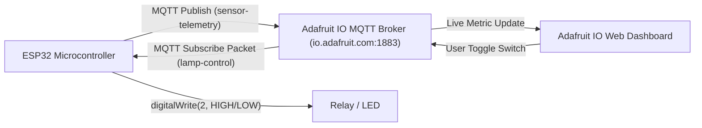

# MQTT Architecture: Adafruit IO Telemetry & Control

```mermaid
flowchart LR
    ESP32["ESP32 Microcontroller"]
    Broker["Adafruit IO MQTT Broker (io.adafruit.com:1883)"]
    Dashboard["Adafruit IO Web Dashboard"]

    ESP32 -->|"MQTT Publish (sensor-telemetry)"| Broker
    Broker -->|"Live Metric Update"| Dashboard
    Dashboard -->|"User Toggle Switch"| Broker
    Broker -->|"MQTT Subscribe Packet (lamp-control)"| ESP32
    ESP32 -->|"digitalWrite(2, HIGH/LOW)"| Relay["Relay / LED"]
```
